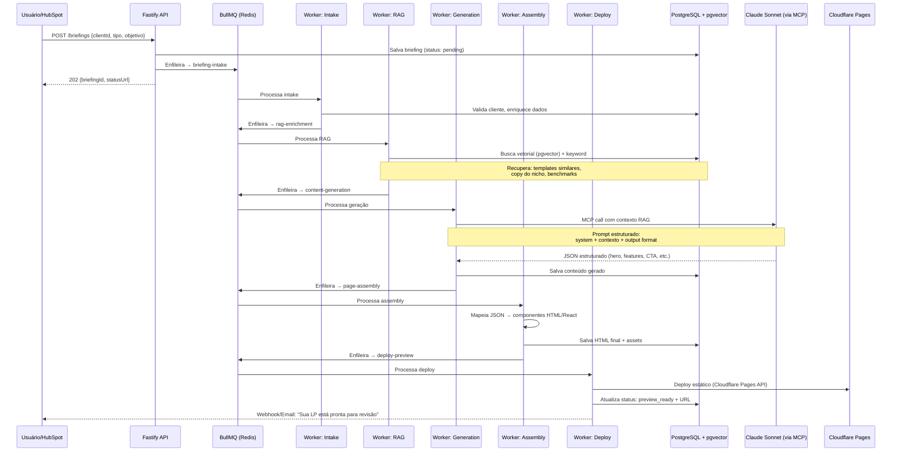

# 🔍 LP Engine — Análise Arquitetural

## Resumo Executivo

Analisei a arquitetura proposta do **LP Engine** — um sistema de automação de Landing Pages com IA usando MCP + RAG + Claude Sonnet. Identifiquei **12 incoerências**, **8 oportunidades de otimização** e reorganizei a arquitetura para ser mais eficiente e production-ready.

---

## 1. Incoerências Identificadas

### 🔴 Críticas

| # | Problema | Onde | Impacto |
|---|---------|------|---------|
| 1 | **MCP mal posicionado** — O MCP (Model Context Protocol) não é um "serviço" que roda dentro de `services/`. É um protocolo de comunicação entre Host (sua API) e Servers (ferramentas). Colocar "MCP Servers" dentro da pasta `services/` mistura responsabilidades. | `apps/api/src/services/` | Alto — Acoplamento arquitetural, dificulta manutenção e escalabilidade |
| 2 | **RAG sem vector store** — A arquitetura menciona RAG mas não inclui nenhum vector database (Pinecone, Qdrant, pgvector). Sem isso, não existe RAG — existe apenas prompt injection com dados brutos. | Estrutura geral | Alto — O "R" do RAG não funciona sem retrieval vetorial |
| 3 | **BullMQ Workers órfãos** — Workers definidos em `apps/api/src/workers/` mas sem filas definidas, sem dashboard de monitoramento, e sem estratégia de retry/dead-letter. | `apps/api/src/workers/` | Alto — Jobs podem falhar silenciosamente |
| 4 | **Seed scripts na raiz** — Scripts de seed em `scripts/` acessam o Prisma Client que está em `packages/database/`. Sem configuração de workspace paths, o import vai falhar. | `scripts/` | Médio — Quebra no setup inicial |

### 🟡 Moderadas

| # | Problema | Onde | Impacto |
|---|---------|------|---------|
| 5 | **`shared-types` redundante com Prisma** — O Prisma já gera tipos TypeScript automaticamente. Um pacote `shared-types` separado vai criar drift entre o schema real e os tipos usados no frontend. | `packages/shared-types/` | Médio — Tipos desincronizados |
| 6 | **Dashboard Next.js separado sem API routes** — Se o dashboard é Next.js com App Router, ele pode consumir a API Fastify via fetch OU ter suas próprias API routes. A arquitetura não define essa boundary. | `apps/dashboard/` | Médio — Ambiguidade de responsabilidade |
| 7 | **Docker Compose sem healthchecks** — `pnpm docker:up` sem healthchecks significa que `pnpm db:push` pode rodar antes do PostgreSQL aceitar conexões. | `docker-compose.yml` | Médio — Setup flaky |
| 8 | **Custos de produção inconsistentes** — Dashboard e LPs no Vercel = US$40/mês, mas as LPs geradas são estáticas e poderiam usar Cloudflare Pages (gratuito). API no Railway/DO custa ~US$12, mas com Redis (Upstash) + PG (Neon) separados, a latência cross-region pode ser alta. | Tabela de custos | Médio — Custo 2x acima do necessário |

### 🟢 Menores

| # | Problema | Onde | Impacto |
|---|---------|------|---------|
| 9 | **`pnpm db:migrate` vs `pnpm db:push`** — Ambos estão nos scripts mas fazem coisas conflitantes. `db:push` é para dev, `db:migrate` é para produção. Sem documentação de quando usar cada um. | Scripts | Baixo |
| 10 | **Sem estratégia de versionamento** — Monorepo sem turborepo/nx configurado explicitamente. | Raiz | Baixo |
| 11 | **`pnpm seed:hubspot` com token inline** — Token passado via variável de ambiente inline é inseguro e não funciona no Windows (PowerShell). | Scripts | Baixo |
| 12 | **Rotas muito genéricas** — Apenas `POST /api/briefing` e `GET /api/status/:id`. Falta CRUD de clientes, listagem de LPs, preview, publicação. | `apps/api/src/routes/` | Baixo — Incompleto |

---

## 2. Otimizações de Eficiência

### O1 — Consolidar MCP como camada de transporte, não serviço

```
❌ Antes:  services/mcp-server.ts  (monolítico)
✅ Depois: mcp/servers/{hubspot,analytics,deploy}.ts  (domain-driven)
```

Cada MCP Server deve ser um **bounded context** isolado, seguindo o padrão domain-driven recomendado pelo protocolo. Isso permite que o Claude chame ferramentas específicas sem carregar todo o contexto.

### O2 — pgvector ao invés de vector database externo

Para o volume esperado (centenas de clientes, não milhões), usar a extensão **pgvector** no PostgreSQL existente elimina um serviço inteiro da stack:

```
❌ Antes:  PostgreSQL + Pinecone/Qdrant  (2 bancos, 2 custos)
✅ Depois: PostgreSQL + pgvector          (1 banco, embeddings nativos)
```

### O3 — Eliminar `shared-types`, usar inferência do Prisma

```typescript
// packages/database/index.ts — exporta tudo
export { PrismaClient } from '@prisma/client';
export type { Client, LandingPage, Briefing } from '@prisma/client';

// Em qualquer app:
import type { Client } from '@genesis/database';
```

### O4 — BullMQ com Board integrado

Adicionar `@bull-board/fastify` para monitoramento visual das filas, e definir estratégias de retry explícitas:

```typescript
// Filas necessárias:
// 1. briefing-intake    — Recebe e valida briefing
// 2. rag-enrichment     — Busca contexto vetorial
// 3. content-generation — Chama Claude via MCP
// 4. page-assembly      — Monta HTML/componentes
// 5. deploy-preview     — Deploy para preview URL
```

### O5 — Unificar hosting de LPs geradas

LPs geradas são HTML estático. Servir via **Cloudflare Pages** (gratuito, edge global) ao invés de Vercel adicional:

```
❌ Antes:  Dashboard (Vercel $20) + LPs (Vercel $20) = $40/mês
✅ Depois: Dashboard (Vercel $20) + LPs (Cloudflare Pages $0) = $20/mês
```

### O6 — Turborepo explícito no monorepo

Sem Turborepo, `pnpm dev` precisa orquestrar builds manualmente. Com ele:

```json
// turbo.json
{
  "pipeline": {
    "build": { "dependsOn": ["^build"] },
    "dev": { "cache": false, "persistent": true },
    "db:push": { "cache": false }
  }
}
```

### O7 — Health checks no Docker Compose

```yaml
services:
  postgres:
    healthcheck:
      test: ["CMD-SHELL", "pg_isready -U genesis"]
      interval: 5s
      timeout: 3s
      retries: 5
```

### O8 — Seed scripts como pacote interno

Mover scripts para dentro do workspace do monorepo para resolver imports:

```
❌ Antes:  scripts/seed-from-csv.ts (import quebrado)
✅ Depois: packages/database/src/seeds/from-csv.ts (acesso direto ao Prisma)
```

---

## 3. Arquitetura Revisada

### Estrutura de Diretórios Otimizada

```
lp-engine/
├── apps/
│   ├── api/                        # Fastify — API + Orquestrador
│   │   └── src/
│   │       ├── routes/
│   │       │   ├── briefing.ts     # POST /briefings, GET /briefings/:id
│   │       │   ├── clients.ts      # CRUD /clients
│   │       │   ├── pages.ts        # GET /pages, POST /pages/:id/publish
│   │       │   └── webhooks.ts     # POST /webhooks/hubspot
│   │       ├── orchestrator/       # Pipeline de geração (orquestra as filas)
│   │       │   ├── pipeline.ts     # Define o fluxo: intake → enrich → generate → assemble → deploy
│   │       │   └── strategies/     # Estratégias por tipo de LP (e-commerce, serviço, SaaS)
│   │       ├── queues/             # BullMQ — Definição e config das filas
│   │       │   ├── definitions.ts  # Nomes, retry policies, rate limits
│   │       │   └── board.ts       # Bull Board para monitoramento
│   │       ├── workers/            # BullMQ — Processadores
│   │       │   ├── briefing-intake.worker.ts
│   │       │   ├── rag-enrichment.worker.ts
│   │       │   ├── content-generation.worker.ts
│   │       │   ├── page-assembly.worker.ts
│   │       │   └── deploy-preview.worker.ts
│   │       ├── mcp/                # MCP Servers — Bounded contexts
│   │       │   ├── hubspot.server.ts    # Tools: buscar_cliente, atualizar_deal
│   │       │   ├── analytics.server.ts  # Tools: metricas_nicho, benchmarks
│   │       │   └── deploy.server.ts     # Tools: publicar_lp, gerar_preview
│   │       ├── rag/                # RAG — Retrieval pipeline
│   │       │   ├── embeddings.ts   # Geração de embeddings (Voyage/OpenAI)
│   │       │   ├── retriever.ts    # Busca híbrida (pgvector + keyword)
│   │       │   └── chunker.ts      # Estratégias de chunking por tipo de conteúdo
│   │       ├── plugins/            # Plugins Fastify
│   │       │   ├── auth.ts         # API key validation
│   │       │   ├── redis.ts        # Conexão Redis
│   │       │   └── prisma.ts       # Prisma Client singleton
│   │       └── server.ts
│   │
│   └── dashboard/                  # Next.js 15 — Interface da Gênesis
│       └── src/
│           ├── app/
│           │   ├── (auth)/         # Login/registro
│           │   ├── dashboard/      # Visão geral
│           │   ├── clients/        # Gestão de clientes
│           │   ├── pages/          # LPs geradas (preview, edição, publicação)
│           │   └── queue/          # Status das filas (read-only mirror do Bull Board)
│           └── components/
│               └── ui/             # Shadcn/ui components
│
├── packages/
│   └── database/                   # Prisma — Fonte única de verdade
│       ├── prisma/
│       │   ├── schema.prisma       # Schema com pgvector
│       │   └── migrations/         # Migrations versionadas (produção)
│       ├── src/
│       │   ├── client.ts           # Prisma Client singleton exportado
│       │   ├── seeds/
│       │   │   ├── from-csv.ts     # Import CSV HubSpot
│       │   │   ├── from-api.ts     # Sync API HubSpot
│       │   │   └── dev.ts          # Dados de desenvolvimento
│       │   └── index.ts            # Re-exporta client + tipos gerados
│       └── package.json
│
├── infra/                          # IaC e configs de deploy
│   ├── docker-compose.yml          # Dev: PostgreSQL + Redis
│   ├── docker-compose.prod.yml     # Prod: com Traefik, métricas
│   └── Dockerfile                  # Multi-stage build da API
│
├── turbo.json                      # Pipeline do Turborepo
├── pnpm-workspace.yaml             # Definição do monorepo
├── .env.example                    # Template documentado
└── README.md
```

### Fluxo de Dados (Pipeline)



### Modelo de Dados (Prisma Schema)

```prisma
generator client {
  provider        = "prisma-client-js"
  previewFeatures = ["postgresqlExtensions"]
}

datasource db {
  provider   = "postgresql"
  url        = env("DATABASE_URL")
  extensions = [vector] // pgvector
}

model Client {
  id          String   @id @default(cuid())
  name        String
  email       String   @unique
  phone       String?
  company     String?
  niche       String   // "restaurante", "clinica", "ecommerce"
  city        String?
  state       String?  @default("RJ")
  hubspotId   String?  @unique
  metadata    Json?    // Dados extras do HubSpot
  briefings   Briefing[]
  createdAt   DateTime @default(now())
  updatedAt   DateTime @updatedAt

  @@index([niche])
  @@index([hubspotId])
}

model Briefing {
  id          String        @id @default(cuid())
  clientId    String
  client      Client        @relation(fields: [clientId], references: [id])
  type        LPType        // SERVICO, ECOMMERCE, SAAS, EVENTO
  objective   String        // "Captar leads", "Vender produto X"
  tone        String?       // "profissional", "descontraído", "premium"
  references  String[]      // URLs de referência
  status      BriefingStatus @default(PENDING)
  pages       LandingPage[]
  jobId       String?       // BullMQ job ID para tracking
  errorLog    String?       // Último erro (se houver)
  createdAt   DateTime      @default(now())
  updatedAt   DateTime      @updatedAt

  @@index([status])
  @@index([clientId])
}

model LandingPage {
  id            String    @id @default(cuid())
  briefingId    String
  briefing      Briefing  @relation(fields: [briefingId], references: [id])
  version       Int       @default(1)
  contentJson   Json      // Conteúdo estruturado por seções
  htmlOutput    String?   // HTML final renderizado
  previewUrl    String?   // URL do preview (Cloudflare)
  publishedUrl  String?   // URL publicada final
  status        PageStatus @default(DRAFT)
  score         Float?    // Score de qualidade (opcional)
  publishedAt   DateTime?
  createdAt     DateTime  @default(now())
  updatedAt     DateTime  @updatedAt

  @@index([briefingId])
  @@index([status])
}

model Embedding {
  id          String                    @id @default(cuid())
  content     String                    // Texto original
  vector      Unsupported("vector(1536)") // Embedding vector
  sourceType  EmbeddingSource           // TEMPLATE, COPY, BENCHMARK
  metadata    Json?                     // {nicho, tipo, score}
  createdAt   DateTime                  @default(now())

  @@index([sourceType])
}

enum LPType {
  SERVICO
  ECOMMERCE
  SAAS
  EVENTO
  PORTFOLIO
}

enum BriefingStatus {
  PENDING
  INTAKE
  ENRICHING
  GENERATING
  ASSEMBLING
  DEPLOYING
  PREVIEW_READY
  PUBLISHED
  FAILED
}

enum PageStatus {
  DRAFT
  PREVIEW
  REVIEW
  APPROVED
  PUBLISHED
  ARCHIVED
}

enum EmbeddingSource {
  TEMPLATE
  COPY
  BENCHMARK
  CLIENT_HISTORY
}
```

---

## 4. Decisões de Design e Trade-offs

### D1 — Fastify vs. Next.js API Routes

| Critério | Fastify (escolhido) | Next.js API Routes |
|----------|--------------------|--------------------|
| Performance | ✅ 2-3x mais rápido | ❌ Overhead do framework |
| WebSocket/SSE | ✅ Nativo | ⚠️ Limitado no Vercel |
| BullMQ Workers | ✅ Mesmo processo Node | ❌ Serverless não suporta |
| Long-running jobs | ✅ Processo persistente | ❌ Timeout de 60s |

**Veredicto:** Fastify é a escolha certa para essa arquitetura. Workers BullMQ precisam de um processo Node.js persistente.

### D2 — pgvector vs. Vector DB dedicado

| Critério | pgvector (recomendado) | Pinecone/Qdrant |
|----------|----------------------|-----------------|
| Custo adicional | ✅ $0 (já paga PG) | ❌ $25-70/mês |
| Latência | ✅ Mesmo servidor | ⚠️ Network hop |
| Escala | ⚠️ Até ~1M vectors | ✅ Bilhões |
| Complexidade ops | ✅ Zero adicional | ❌ Mais um serviço |

**Veredicto:** Para < 100k embeddings (templates + copy + benchmarks), pgvector é mais que suficiente e elimina um serviço da stack.

### D3 — MCP como orquestrador de ferramentas

O MCP **não substitui** a pipeline BullMQ. Ele atua como **interface de ferramentas** que o Claude pode chamar durante a etapa de geração:

```
Pipeline BullMQ: intake → enrich → generate → assemble → deploy
                                        ↑
                                   MCP Server Tools:
                                   - buscar_cliente(id)
                                   - templates_similares(nicho)
                                   - benchmarks_nicho(nicho)
                                   - gerar_secao(tipo, contexto)
```

### D4 — Estratégia de Chunking para RAG

Para landing pages, o chunking deve ser **por seção**, não por tokens:

```typescript
// ❌ Chunking genérico (ruim para LPs)
splitByTokens(text, 512)

// ✅ Chunking semântico (ideal para LPs)
splitBySections(template, {
  sections: ['hero', 'features', 'testimonials', 'pricing', 'cta'],
  preserveMetadata: true,  // nicho, tipo, score de conversão
})
```

---

## 5. Mapa de Custos Otimizado

| Serviço | Plataforma | Antes | Depois | Economia |
|---------|-----------|-------|--------|----------|
| PostgreSQL + pgvector | Neon | $0-25 | $0-25 | — |
| Redis | Upstash | $0 | $0 | — |
| Vector DB | Pinecone | ~$25 | **$0** (pgvector) | **-$25** |
| API | Railway | $12 | $5-12 | — |
| Dashboard | Vercel | $20 | $20 | — |
| LPs geradas | Vercel | $20 | **$0** (CF Pages) | **-$20** |
| IA | Anthropic | ~$0.20/LP | ~$0.15/LP | -25% (cache MCP) |
| **Total** | | **~$77-82/mês** | **~$25-57/mês** | **~$25-45/mês** |

> [!TIP]
> A economia de ~R$150-250/mês vem de duas mudanças simples: pgvector ao invés de vector DB externo, e Cloudflare Pages ao invés de Vercel para LPs estáticas.

---

## 6. Checklist de Implementação

- [ ] **Fase 0 — Scaffolding** (1-2 dias)
  - [ ] Inicializar monorepo com `pnpm` + Turborepo
  - [ ] Configurar `packages/database` com Prisma + pgvector
  - [ ] Docker Compose com healthchecks
  - [ ] `.env.example` documentado

- [ ] **Fase 1 — API Core** (3-4 dias)
  - [ ] Fastify com plugins (auth, prisma, redis)
  - [ ] Rotas CRUD: clients, briefings, pages
  - [ ] BullMQ: definição de filas + Bull Board
  - [ ] Workers: briefing-intake + rag-enrichment

- [ ] **Fase 2 — RAG + MCP** (3-5 dias)
  - [ ] Pipeline de embeddings com pgvector
  - [ ] Retriever híbrido (vetorial + keyword)
  - [ ] MCP Servers: hubspot, analytics, deploy
  - [ ] Worker: content-generation (integração Claude)

- [ ] **Fase 3 — Assembly + Deploy** (2-3 dias)
  - [ ] Worker: page-assembly (JSON → HTML)
  - [ ] Worker: deploy-preview (Cloudflare Pages API)
  - [ ] Notificações (email/webhook)

- [ ] **Fase 4 — Dashboard** (3-5 dias)
  - [ ] Next.js 15 com App Router
  - [ ] Telas: dashboard, clientes, LPs, filas
  - [ ] Preview/edição de LP antes de publicar

- [ ] **Fase 5 — Produção** (2-3 dias)
  - [ ] Dockerfile multi-stage
  - [ ] CI/CD (GitHub Actions)
  - [ ] Monitoring (Sentry + Uptime)
  - [ ] Migrations versionadas

> [!IMPORTANT]
> **Estimativa total: 14-22 dias** de desenvolvimento para um dev full-stack sênior trabalhando sozinho.
